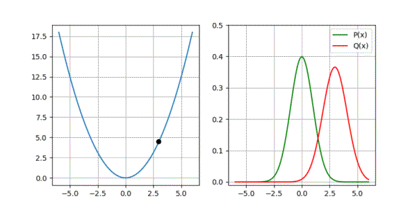

## KL Divergence based loss for learning Gaussian distribution for regression problems

The code is provided as implementation of KL divergence based loss for learning Gaussian distribution. It additionally include the function, partial derivatives to the function as well as optimisation using gradient descent. 

Here is the output from this code, which is part of a series of blog posts at [adeeplearner.github.io](adeeplearner.github.io)

